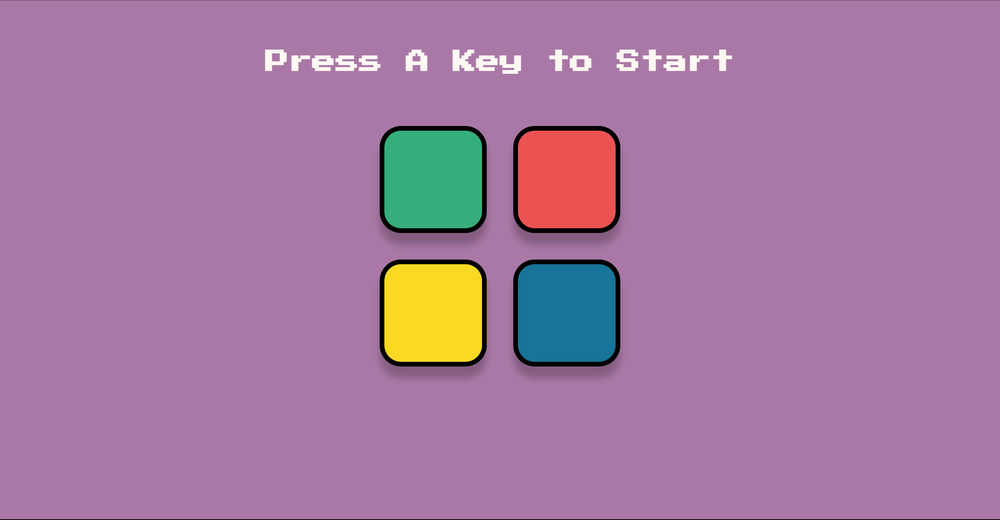

# The Simon Game

**'The Simon Game' is a web-based game built with HTML, CSS, JavaScript, and jQuery that tests memory by repeating increasingly complex sequences of lights and sounds. This is created as part of coding challenge from "The Complete Web Development Bootcamp" .**

---

<!DOCTYPE html>
 
<html lang="en" dir="ltr">
  <head>
    
  </head>
 
</html>

**Files Structure**

    - HTML: Contains the structure of the game interface.
    - CSS: Styles the game elements for a visually appealing layout.
    - JavaScript ('game.js'): Manages the game logic, user interactions, and UI updates.
    Game Logic (JavaScript)

**Variables:**

    - `buttonColors`: An array holding the color names used in the game.
    - `gamePattern`: An array to store the sequence of colors that the player needs to memorize.
    - `userClickedPattern`: An array to keep track of the sequence of colors the user has clicked.
    - `started`: A boolean flag to indicate whether the game has started.
    - `level`: Tracks the current level of the game.

**Game Flow:**

    - Initialization: The game waits for the user to initiate the first level.
    - Sequence Generation (`nextSequence` function):
    - Increments the game level.
    - Updates the level display.
    - Generates a random color sequence by selecting a random color from `buttonColors` and adding it to `gamePattern`.
    - Displays the sequence to the user with animations and sounds (code for animations and sounds is indicated but not shown in the provided excerpt).

**User Interaction:**

    - The user attempts to replicate the sequence by clicking on the colored buttons in the correct order.
    - The user's clicks are tracked and compared against the `gamePattern` to determine success or failure.

**UI Elements:**

    - Level Title: Displays the current level of the game.
    - Colored Buttons: Interactive elements that the user clicks in sequence.

**Press any key to start the game. The game level is displayed, and a sequence of colors is generated. Click on the buttons in the correct order to repeat the sequence. Each button click triggers an animation and a sound effect. If the sequence is correct, the game level increases, and a new sequence is generated. If the sequence is incorrect, the game ends.**

**Link for preview: https://htmlpreview.github.io/?https://github.com/fahim-ysr/The-Simon-Game/blob/main/index.html**
